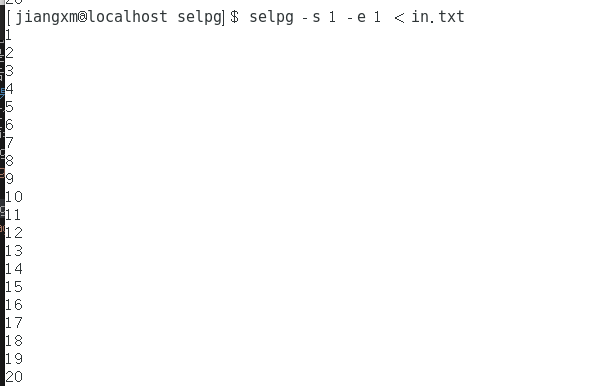

#设计思路
- 在学习了众多大佬的博客和查找资料后，我将整个过程分为了三个函数来处理。
    - 首先是Parse函数，用来初始化参数并设置简单的usage
    - 再是check函数检查各参数是否符合规范，不合规范的指出相应错误
    - 最后是handle函数，主要用处根据是否根据换行符分页将读取的文件分页，还有若有目的文件，则传输相应信息
#测试结果
- 测试文件为in.txt，文本内容为1-20的每行单个排列
- 测试结果如下
    - selpg -s 1 -e 1 in.txt
    

    - selpg -s 1 -e 1 < in.txt
    

    - selpg -s1 -e1 in.txt >out.txt
    

    - selpg -s1 -e1 in.txt 2>error.txt
    

    - selpg -s1 -e1 in.txt 2>dev/null
    

    - 使用cat指令
    

    - 更改可显示的行数l
    

    - 报错信息
    